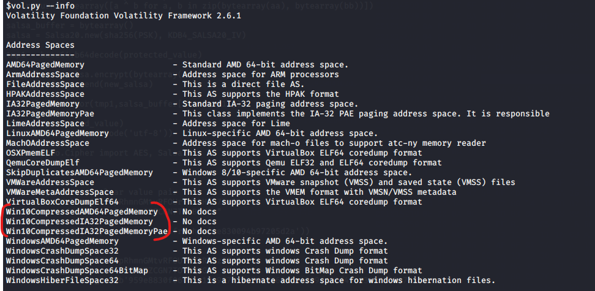
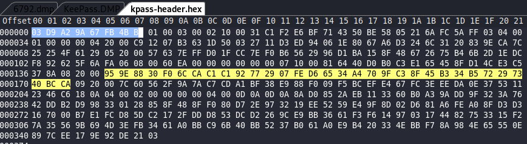
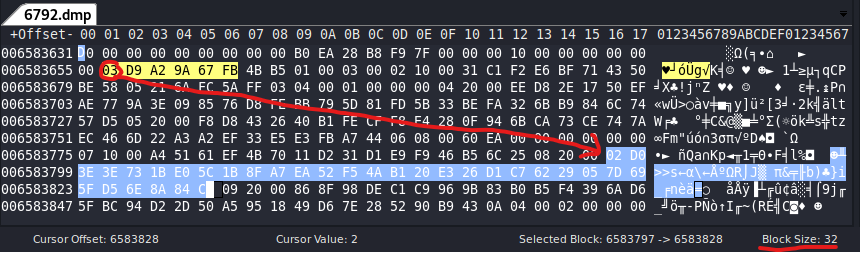

# ACSC Mary Poppins Forensic Challenge

## Overview

## Artefacts

### Windows 10 Memory image

Analysing this with volatility (need to use a version that includes support for 
compressed memory pages like the version from FireEye) you can see that a keepass process. 
By dumping this processes memory you can access key configuration details and data structures 
required to recover protected passwords.

To confirm your version of volatility has the requisite ability to process compressed memory as used in Windows 10
do the following:



### Keepass.xml

This can be extracted from the memory sample provided by dumping the memory for PID 6792. 
Running strings on the resulting dump file allows you to identify and extract the KeePass XML file,
which contains a number of protected password fields:

```xml
<Value Protected="True">Hn/u5QlyW8w=</Value>

<Value Protected="True">/U+YEZg=</Value>
```

The memory dump will also contain key keepass data structures, such as the Protected Stream Key that are 
required for 'unprotecting' protected values in the XML file.
## Analysis

### Hexdump of keepass memory space to identify header values

#### Test instance versus captured image

#### Extraction of relevant header values (eg Protected Stream Key)

#### Recovery of protected values

### Kdbx File Format
    +-------------------------------------------------------------------+
    |  4  |  4  |  4  |1| 2 | ... | x{3} |     32     | ...             |
    +--+-----+-----+---+--+----+-----+---------+---------+--------------+
       |     |     |   |  |    |     |         |         |
       |     |     |   |  |    |     |         |         +-> Xml document (could be encrypted)
       |     |     |   |  |    |     |         +-> Stream start bytes (must match header correlating header)
       |     |     |   |  |    |     +-> Repeat of header fields until EOH type
       |     |     |   |  |    +->Header Field Data
       |     |     |   |  +-> Header Field Size
       |     |     |   +-> Header Field Type
       |     |     +-> File Ver
       |     +-> Sig 2
       +-> Sig 1

#### Signatures:
           |   kdb      |  kdbx pre-rel | kdbx relese |
    byte 1 | 0x9aa2d903 | 0x9aa2d903    | 0x9aa2d903  |
    byte 2 | 0xb54bfb65 | 0xb54bfb66    | 0xb54bfb67  |


#### Recovering protected values

Protected values in the keepass XML format can be recovered by:
- base64 decoding the value
- initialising the Salsa20 cipher
- decrypting values *in order* as they appear in the XML

Relevant sections from the libkeepass code follow:

```python
    def _reset_salsa(self):
        """Clear the salsa buffer and reset algorithm."""
        self._salsa_buffer = bytearray()
        self.salsa = Salsa20.new(
            sha256(self.header.ProtectedStreamKey),
            KDB4_SALSA20_IV)

    def _get_salsa(self, length):
        """
        Returns the next section of the "random" Salsa20 bytes with the 
        requested `length`.
        """
        while length > len(self._salsa_buffer):
            new_salsa = self.salsa.encrypt(bytearray(64))
            self._salsa_buffer.extend(new_salsa)
        nacho = self._salsa_buffer[:length]
        del self._salsa_buffer[:length]
        return nacho

    def _unprotect(self, string):
        """
        Base64 decode and XOR the given `string` with the next salsa.
        Returns an unprotected string.
        """
        tmp = base64.b64decode(string.encode("utf-8"))
        return xor(tmp, self._get_salsa(len(tmp))).decode("utf-8")
```

From this code it is clear that we need the following values:

| Item | Description |
|------:|:------------:|
| KDB4_SALSA20_IV | Constant declared in code ```KDB4_SALSA20_IV = bytes(bytearray.fromhex('e830094b97205d2a'))```|
| ProtectedStreamKey | Value contained in the keepass file header - should be able to extract from the memory dump |
| Length of values | Need the length and order of protected values so the correct elements of Salsa20 buffer can be used for decryption |

#### Accessing the protected streaming key from the keepass header

To find the location of a the protected streaming key, I created a new keepass data base with known credential and secrets. I then created a memory dump
of this for analysis.

Looking at the memory dump in a hex editor, you can see that the signature for the keepass database denoted by the sequence ```03 D9 A2 9A 67 FB 4B B5```. Using the python 
libkeepass library, you can load the same database and dump the protected secret key value as follows:
```python
filename = "test.kdbx"
with libkeepass.open(filename, password='password') as kdb:
    kdb.unprotect()

kdb.header
```

This produces the output below - with the value at dictionary key 8 being the protected stream key:

```
{2: b'1\xc1\xf2\xe6\xbfqCP\xbeX\x05!j\xfcZ\xff',
 3: 1,
 4: b"\xc9\x12\x07\xb3c\x1dP\x03'\x11\xd3\xed\x94\x06\x1e\x80g\xa6\xd3$l1 \x83\x9e\xca|%%Oa)",
 5: b'Wc~\xff\xd0\x1f\xcc~\xf0\xb6V)\x96\xd1\xba\x15\x8fHg&u\xb4k-\x1e\xdc\xf8\x92b_j\xfa',
 6: 60000,
 7: b'\x81d@\xd0\xb0\xc3\xe1eE\x8f\xd1L\xe3\xc57\x8a',
 8: b'\x95\x9e\x880\xf0l\xca\xc1\xc1\x92w)\x07\xfe\xd6e4\xa4p\x9f\xc3\x8fE\xb34\xb5r)s@\xbc\xca',
 9: b'|`V/\x9az\xc7\xcd\xa1\xbf8\xe9\x88\xf0\t\xf5\xbc\xef\xe4g\xfc>\xee\xda\x0e7S\x11#F\xc6\x18',
 10: 2,
 0: b'\r\n\r\n'}
```

Searching for this value in the memory dump using a hex editor we can see the folowing:



*note* that the protected stream key is 32 bytes in length and locate 141 bytes (decimal) from the keepass file header. Taking the memory dump from the provided image we can now look 
to identify the protected stream key for the instance of keepass running in the system being analysed. This is depicted below:



We now have the details we need to recover the protected values identified in the keepass.xml extracted from memory earlier. We do this as follows:

```python
# Required imports for decoding and decrypting data
import base64
from Crypto.Cipher import AES, Salsa20
import hashlib
import binascii

# Known constants and variables
KDB4_SALSA20_IV = bytes(bytearray.fromhex('e830094b97205d2a'))
protected_stream_key = binascii.a2b_hex(b'02D03E3E731BE05C1B8FA7EA52F54AB120E326D1C76229057D695FD56E8A84CD')
salsa_buffer = bytearray()
ctxt1 = 'Hn/u5QlyW8w='  # First protected value from keepass.xml extracted from memory
ctxt2 = '/U+YEZg='         # Second extracted value 

# some helper methods, copied from libkeepass

def sha256(s):
    """Return SHA256 digest of the string `s`."""
    return bytes(hashlib.sha256(s).digest())

def xor(aa, bb):
    """Return a bytearray of a bytewise XOR of `aa` and `bb`."""
    return bytearray([a ^ b for a, b in zip(bytearray(aa), bytearray(bb))])

# set up the buffer for decryption
salsa = Salsa20.new(sha256(protected_stream_key), KDB4_SALSA20_IV)
new_salsa = salsa.encrypt(bytearray(64))
salsa_buffer.extend(new_salsa)

# Process the first ciphertext
tmp1 = base64.b64decode(ctxt1)
ptxt1_bytes = xor(tmp1,salsa_buffer[:len(tmp1)])
print(ptxt1_bytes.decode('utf-8'))

# Process the second ciphertext
tmp2 = base64.b64decode(ctxt2)
ptxt2_bytes = xor(tmp2,salsa_buffer[len(tmp1):len(tmp1) + len(tmp2)]) # ensure you start at the right offset in the Salsa buffer
print(ptxt2_bytes.decode('utf-8'))

```

With the following (disappointing output).

```
Password
12345
```

At least we wroked out how the keepass data structures and field protection worked, but we did not solve the challenge of finding Mary Poppins password 
for the Mary Poppins website. Back to the drawing board.

##### Bonus kdbx : encrypted password in XML  (from the gist in references)

With kdbx file, you can encrypt a password field in the XML document, before the encryption of all the XML document, so that the password
is encrypted twice. To decrypt these password, you have to sequentially look in the XML document for “Value” node with the “Protected” attribute set to “True”.  
To decrypt the password, you should use the cipher declared in the “Inner Random Stream ID” field of the header, initiating it with the value of the field 
“Protected Stream Key” as its key/seed and the fixed IV “0xE830094B97205D2A”.

First you need to pass the password through a base64decode function, then you decrypt the result with the cipher : because the cipher is a stream cipher, 
you need to XOR the result of the decryption with the result of the base64decode function to obtain the real password.

## Tools

1. Volatility - with compressed memory pages modification by FireEye
2. iPython / Jupyter notebooks
3. wxHexEditor
4. libkeepass

# References

- [FireEye Win10 Volatility](https://github.com/fireeye/win10_volatility)
- [HackTM CTF Quals 2020: Find My Pass](https://blog.bi0s.in/2020/02/09/Forensics/HackTM-FindMyPass/)
- [libkeepass - kdb4.py](https://github.com/libkeepass/libkeepass/blob/master/libkeepass/kdb4.py)
- [KDBX v2 File Format](https://github.com/Stoom/KeePass/wiki/KDBX-v2-File-Format)
- [Explanation of how to recover protected values from keepass.xml](https://gist.github.com/lgg/e6ccc6e212d18dd2ecd8a8c116fb1e45)
- [CTF time write up for keepass challenge](https://ctftime.org/writeup/18205)
- [LaZagne retrieve keepass password from memory](https://github.com/AlessandroZ/LaZagne/commit/daf0f2534c28779c20fc5bad81e9f9b2a59e99e9)
