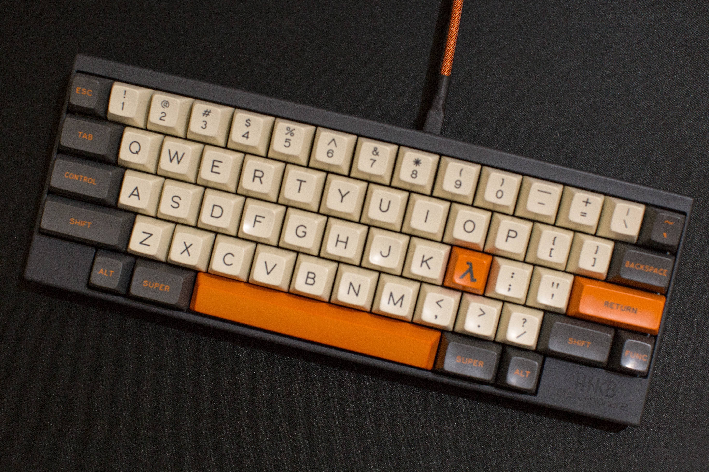
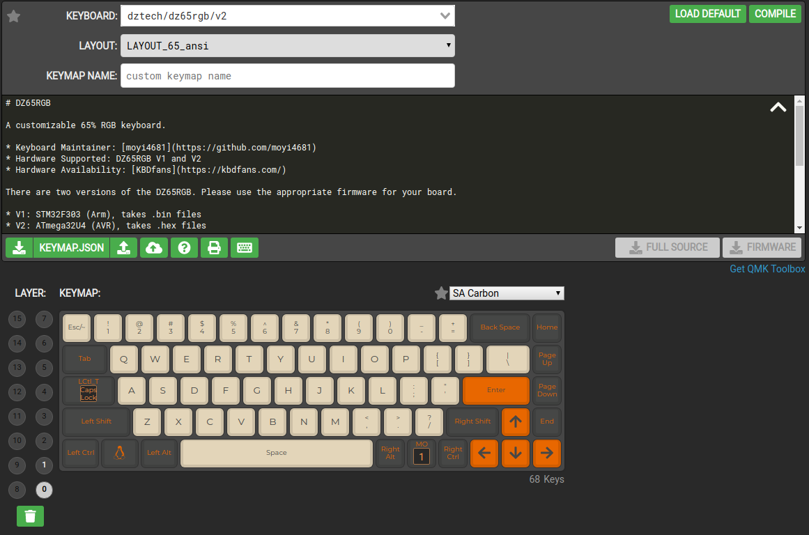

# Guide to QMK configuration and updates



## What

My son gifted me a wonderful, custom built keyboard. It is a dztech,
65% RGB with XXX keys, XXX keycaps and QMK firmware. This firmware
allows you to define custom keymaps # Guide to QMK configuration
and updates by flashing the onboard controller.

## Why

Using a 65% keyboard means you will not necessarily have access to all
the keys you might use. I do lots of work in the shell, vi, and
programming so keys like tilde, backtick, insert, etc are important to
my workflows.

## How

Keymaps (the mapping between inputs on the keyboard and the
characters they send to the PC) are easily modifiable on the [QMK
configurator](https://config.qmk.fm/#/dztech/dz65rgb/v2/LAYOUT_65_ansi)
website. This tool can also be downloaded or run locally in a docker
container.



Some important concepts are:
- keymaps can be layered and a mode (MO) key is used to select the
    currently active layer
- configuration is performed by dragging and dropping relevant keys to
    the right location on the diagrammatic representation of your
    keyboard
- configuration can be exported / imported from json formatted files
- configurations can be compiled to hex for flashing to the keyboard

For my specific usecase I use the following work flow.

1. QMK tools and dependencies are installed via pip

 ```
 pip3 install qmk
 qmk setup
 qmk config user.keyboard=dztech/dz65rgb/v2
 qmk config user.keymap=ctixsystems
 ```
2. Keymap configurations are made on the configurator website
and the JSON file downloaded via the export function. ***NB***
this file needs to be saved in the qmk folder structure for the
configured username.

3. Updated configuration is flashed to the keyboard. Placing the
   keyboard in to flash mode will vary from device to device, but for
   the dztec the ESC key is held down while connecting the usb cable.
   Flashing is performed as follows:

   ```
   qmk flash ~/qmk_firmware/keyboards/dztech/dz65rgb/keymaps/ctixsystems/keymap.json
   ```
## References
 - [KBD fans](http://kbdfans.com)
 - [QMK github](https://github.com/qmk/)
 - [QMK configurator](https://config.qmk.fm/#/dztech/dz65rgb/v2/LAYOUT_65_ansi)
 - [QMK tutorial](https://beta.docs.qmk.fm/tutorial)
