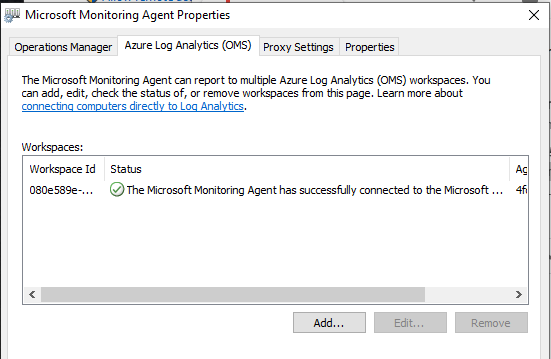

## Getting sysmon logs in to Azure log analytics

Sysmon is a highly effective and free tool from Microsoft that allows detailed logging of events on windows hosts. These event logs can be collected and forwarded to log analytics in Azure and assuming you generate fewer than 5G of logs per month, you will remain within the Azure free tier for this service!

The following notes summarize the steps taken to:

> 1. Create and configure an Azure log analytics workspace to receive sysmon (and other log data)
> 2. Deploy sysmon to generate logs on windows hosts and deploy the Microsoft Monitoring Agent to ship the logs to log analytics
> 3. Monitor and query the logs

## Configure Azure log analytics work space
Using access to the [Azure Portal](https://portal.azure.com), create a new [log analytics workspace](https://portal.azure.com/#create/Microsoft.LogAnalyticsOMS).

With the workspace created, navigate using the blades to Home -> Log Analytics workspaces -> WORKSPACE_NAME -> Advanced settings.

Two things must be done in this blade:
> 1. Add the Sysmon data source
> 2. Access the windows agent and WORKSPACE ID and PRIMARY KEY data required for configuring the Microsoft Monitoring Agent that will be installed on Windows hosts

### Adding the Symon data source

By default, the ```Microsoft-Windows-Sysmon/Operational``` event log is not listed and needs to be manually added per the screenshot below. **Remember to click 'save'**


### Getting the Microsoft Monitoring Agent and configuration data

Next the ```Connected sources``` -> ```Windows Servers``` menu needs to be selected. Here you can:
> 1. Download the relevant Windows Agent for your architecture
> 2. Make note of the configuration details (Workspace ID and Primary Key)


## Deploy Sysmon and Microsoft Monitoring Agent

On the endpoints to be monitored, both sysmon and the Microsoft Management Agent (as downloaded earlier) must be configured and installed.

### Sysmon installation

Numerous guides exist on installing and configuring sysmon and that level of detail is not replicated here (check the references section below if Google searchers are not working for you.). In summary, to get sysmon up and going you will need to download sysmon and an associated configuration file and install these on each host to be monitored.

> The [SwiftOnSecurity](https://github.com/SwiftOnSecurity/sysmon-config) configuration is well regarded and will get you up and running. **Note** to include DNS logging you need to use the z-AlphaVersion.xml

Installation is as simple as running the following from an Administrative command prompt:

```
Sysmon64.exe -i sysmonconfig-export.xml -accepteula -h md5,sha256 -n -l 
```

### Installing the Microsoft Monitoring Agent

Using the MMA downloaded earlier from the log analytics workspace, launch the application as an administrative user and populate the Workspace ID and Primary Key per the image below.


Assuming details were entered correctly and the network is functioning you will see a success message:



## Profit!

All going well, in a few minutes you should see log data coming in to the log analytics workspace. Some further configuration is required to get the incoming logs correctly parsed. Fortunately the Microsoft security team has provided the necessary [KQL](https://raw.githubusercontent.com/Azure/Azure-Sentinel/master/Parsers/SysmonParser.txt) to make this straight forward.

Copy the KQL text provided in to a new log analytics query and save as a function. 


You can then use the Alias for that function to get sweet, parsed sysmon data in Azure log analytics. 


### Analysis

Now that the data is parsed and searchable, you can make use of log analytics search and reporting capabilities.

#### Observe the frequency of specific Event IDs over time


#### See which processes on a host are resolving which domains


## References
- [Using Sysmon in Azure Sentinel](https://medium.com/blueteamlabs/using-sysmon-in-azure-sentinel-883eb6ffc431)
- [KQL Sysmon Parser by Microsoft](https://raw.githubusercontent.com/Azure/Azure-Sentinel/master/Parsers/SysmonParser.txt)
- [Sysmon](https://docs.microsoft.com/en-us/sysinternals/downloads/sysmon)
